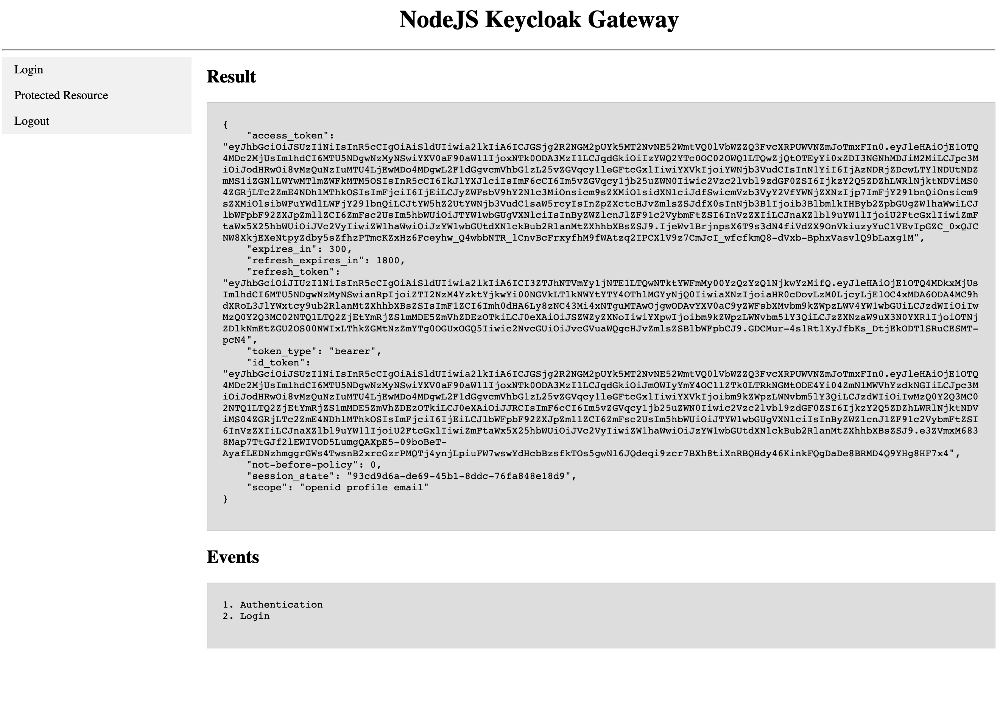

# Gateway

## Getting started:
execute:
```
cd gateway

docker-compose up --build
#to stop the conatiner agin
docker-compose down
```

## User interface:





## node API endpoint:

host: http://localhost:3000/login

user: user

pass: 31nh9fwhf9hw94bf

## keycloak Instance:

host: http://localhost:8080

user: admin

pass: zoTeS58932h2394h23


## PostgreSQL Instance:

POSTGRES_USER: keycloak_user

POSTGRES_PASSWORD: 7xlfDFkLP234324
